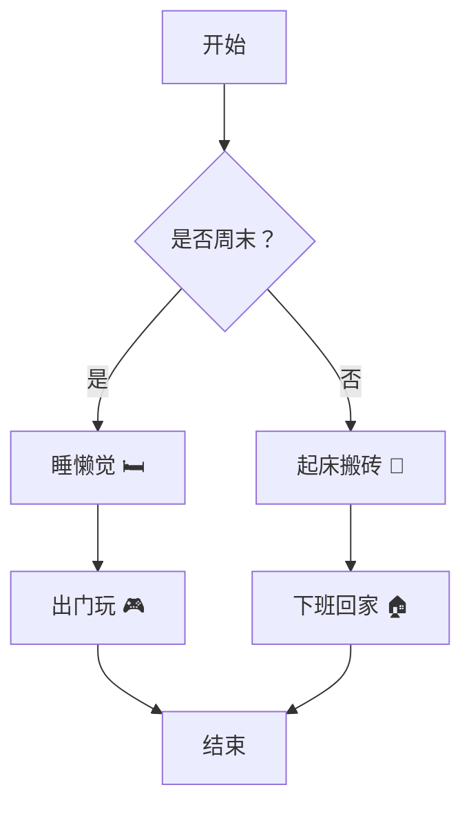
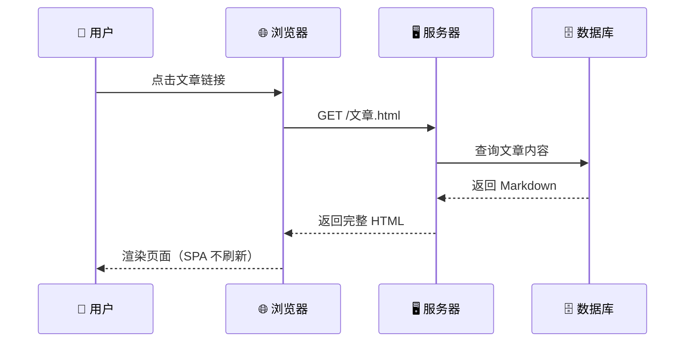

# 流程图与时序图示例

本文展示博客对 **Mermaid 流程图**、**时序图** 以及 **数学公式** 的支持。

## 流程图

> [!tip] 提示
> 流程图使用 ` ```mermaid ` 代码块编写，支持 `graph`、`flowchart` 等关键字。



## 时序图

> [!info] 说明
> 时序图用于描述对象之间的消息交互顺序。



## 数学公式

行内公式：$E = mc^2$

块级公式：

$$
\int_0^\infty e^{-x^2} \, dx = \frac{\sqrt{\pi}}{2}
$$

## Markdown 基础语法

- **加粗**、*斜体*、~~删除线~~
- 表格、列表、引用

| 功能 | 支持情况 |
|------|----------|
| 流程图 | ✅ |
| 时序图 | ✅ |
| 数学公式 | ✅ |
| Obsidian 语法 | ✅ |