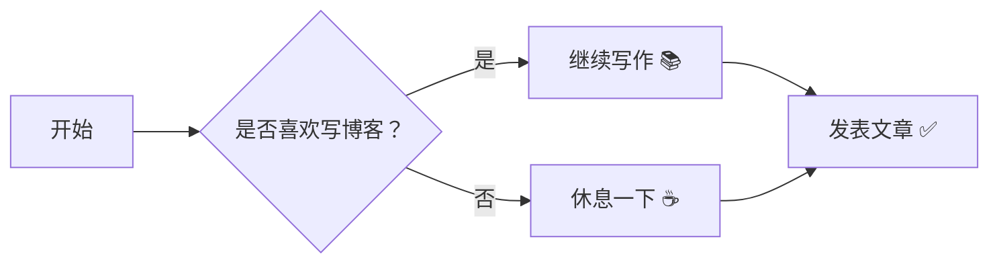

# 博客写作示例

欢迎来到这篇示例文章。本文用于演示本博客系统中常见的写作格式与功能。

## 你可以在这里写：

- 文章标题
- 简洁的小结
- 代码片段
- 表格与列表
- 引用与提示框
- Mermaid 图和数学公式

## Markdown 基础语法

- **加粗**、*斜体*、~~删除线~~
- 表格、列表、引用

| 功能 | 支持情况 |
|------|----------|
| 流程图 | ✅ |
| 时序图 | ✅ |
| 数学公式 | ✅ |
| Obsidian 语法 | ✅ |

## 示例内容

> 这是一个引用块，用于强调重要内容。

### 代码块示例

```js
function greet(name) {
  return `你好，${name}！`;
}
console.log(greet('读者'));
```

### 表格示例

| 功能 | 支持情况 |
|------|----------|
| 代码块 | ✅ |
| 表格 | ✅ |
| 引用 | ✅ |
| Mermaid 图 | ✅ |
| 数学公式 | ✅ |

## 提示与注意

> [!tip]
> 你可以使用自定义提示框来展示重要建议、操作步骤或注意事项。

## Mermaid 流程图示例



## 数学公式示例

行内公式：$a^2 + b^2 = c^2$。

块级公式：

$$
\sum_{n=1}^{\infty} \frac{1}{n^2} = \frac{\pi^2}{6}
$$

## 结语

这篇示例文章展示了本博客支持的基本写作格式和功能。你可以在自己的文章中自由组合这些元素，打造结构清晰、可读性强的内容。
